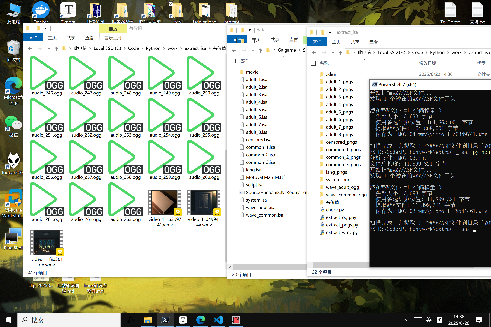

# JELLYFISH专用文件拆包

> **免责声明**：本项目仅供学习和研究目的使用。使用该项目所产生的任何法律责任或风险均由使用者自行承担。作者不对软件使用过程中可能造成的任何损失或法律后果负责，亦不对提取的文件内容的合法性和适用性作任何保证。任何商业使用均需获得相关权利方的明确授权。

想要其中的几首歌曲，遂开发此方案（isa，isv文件）。



## 功能

python实现

- 运行后输出png图片。
- 运行后输出ogg音频。
- 运行后输出wmv视频。
- 支持自定义输出其余多种脚本文件。

## 使用方法

isa：

图片

```
python extract_pngs.py system.isa
```

音频

```
python extract_ogg.py wave_common.isa
```

其他

```
python extract_other.py system.isa
```

isv：

视频

```
python extract_wmv.py MOV_03.isv
```

##  贡献指南

欢迎通过Issue提交建议或PR贡献代码，请遵循以下规范：

1. 使用 Conventional Commits 提交信息
2. 单元测试覆盖率保持90%+
3. 文档更新同步进行

##  许可证

本项目采用 MIT License，保留署名权利。